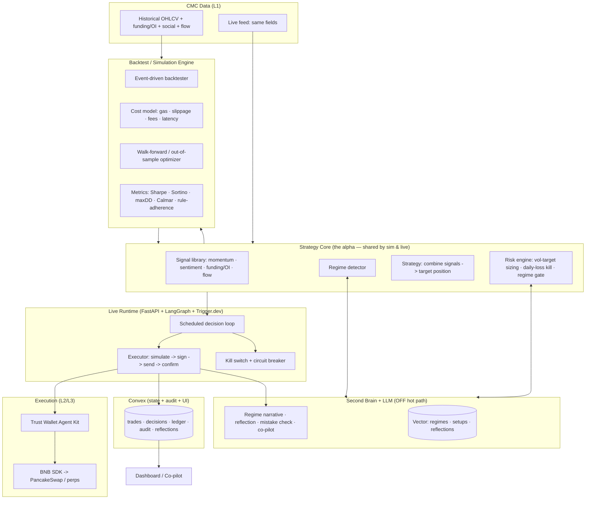

# Alien-Trade — Project Plan (Track-1-First)

> **An autonomous BSC trading agent engineered to win Track 1 of BNB Hack 2026 on risk-adjusted returns, drawdown, and rule adherence.**
> Everything else — Second Brain, multi-agent, token optimization — is supporting cast for that one goal.

---

## 0. Strategic Thesis (read this first)

**Track 1 is scored by PnL replay on held-out live data (Jun 22–28): returns, drawdown, risk-adjusted performance, rule adherence.**

That single fact dictates the entire plan:

1. **The winner is whoever has the best trading edge + tightest drawdown control — not the smartest LLM.** A beautiful agent with negative PnL loses. The alpha lives in the **signal logic + position sizing**, not in reasoning tokens.
2. **The simulator is the optimization engine.** We tune the strategy against a backtest until it's robust — so the backtest engine is the *center of gravity* and is built *early*, not as a Track-2 afterthought.
3. **The simulator is also the trap.** Judges replay on data we've never seen. If we tune until the backtest looks beautiful, we overfit and lose live. So the engine is built **honest from day one**: walk-forward validation, out-of-sample only, real execution costs, regime splits.
4. **Drawdown is a scoring weapon, not a safety feature.** Over a 7-day window variance is huge; risk-adjusted scoring rewards the steady, low-drawdown bot over the volatile high-return one. The risk engine is tuned to *protect drawdown aggressively*.
5. **The LLM / Second Brain stays off the trade hot path.** Reasoning tokens don't beat a tuned rule on a fast market. The LLM earns its place in **regime classification, mistake-avoidance, and post-trade reflection** — not in "should I buy now."

> **Where the edge comes from:** CMC gives data most teams ignore — social/KOL sentiment, derivatives (funding rate, open interest), and on-chain flow — *alongside* price/TA. Combining 2–3 strong, orthogonal signals from these is our biggest lever. See `STRATEGY.md`.

**Track 2 is a near-free byproduct:** the same backtest engine + strategy package *is* the Track 2 submission. We get it for free; we do not divert focus to it.

---

## 1. Status & Key Facts

| Item                          | Value                                                                     |
| ----------------------------- | ------------------------------------------------------------------------- |
| **Event**                     | BNB HACK 2026 (DoraHacks)                                                  |
| **Build phase**               | Jun 3 → Jun 21, 2026                                                       |
| **Live trading window**       | **Jun 22 → Jun 28, 2026 — Track 1 PnL measured here**                      |
| **Submission / judging**      | Jun 29 → Jul 5, 2026                                                       |
| **Today**                     | Jun 5, 2026 → **~16 build days left**                                      |
| **Primary objective**         | **Win Track 1** (autonomous trading, risk-adjusted PnL)                    |
| **Secondary (free) objective**| Track 2 strategy skill (byproduct of the backtest engine)                 |
| **Tertiary**                  | 3 stackable special prizes ($2k each: CMC / TWAK / BNB SDK) via good usage |
| **Execution**                 | Small real capital on BSC mainnet (testnet + paper rehearsal first)       |

> ⚠️ **16-day reality.** A thin end-to-end slice (signal → sim → trade) must work by Day 6. We deepen the *strategy and risk* after that — those are what win.

### Parked decision

- **LLM model selection** — abstract tiers (Tier-0 cheap / Tier-1 reasoning / Tier-2 frontier). The LLM is off the hot path, so this decision is low-stakes and deferred. Exact IDs chosen at Phase 6.

---

## 2. What Wins Track 1 (and what doesn't)

| Capability                          | Verdict for Track 1            | Role                                                                 |
| ----------------------------------- | ------------------------------ | ------------------------------------------------------------------- |
| **Honest backtest/sim engine**      | 🥇 **Decides everything**       | The optimization loop. Walk-forward, real costs, regime splits.     |
| **Signal/edge spec (the alpha)**    | 🥇 **Decides everything**       | 2–3 orthogonal CMC signals (momentum + sentiment + funding/OI/flow).|
| **Drawdown-first risk engine**      | 🥇 **Wins the risk-adj score**  | Vol-targeted sizing, daily-loss kill, regime gating.                |
| Scraped/derivatives data (CMC)      | 🟢 Real edge                    | Funding, OI, social, on-chain flow — the lever others ignore.       |
| Execution reliability (no double-tx)| 🟢 Necessary to not self-destruct| Idempotency, simulate-before-send, on-chain confirm.                |
| Sponsor SDKs (CMC/TWAK/BNB)         | 🟡 Necessary to play, zero alpha | How we fetch + execute. Required, not differentiating.              |
| Second Brain (memory)               | 🟡 Regime + mistake-avoidance   | Off hot path. "What regime, have we lost on this setup before."     |
| LLM reasoning / "best analyzer"     | 🔵 Low priority at runtime       | Slow + expensive + not better than a tuned rule for short horizons. |
| LLM pattern-recognition "signals"   | 🔴 **Avoid**                    | Untestable → simulator can't optimize it. Use deterministic TA/ML.  |

---

## 3. Tech Stack & Roles

| Layer                      | Tech                                  | Responsibility                                                       |
| -------------------------- | ------------------------------------- | ------------------------------------------------------------------- |
| **Strategy + Sim core**    | **Python (numpy/pandas) + Polars**    | 🥇 Signals, backtest engine, walk-forward optimizer, risk model      |
| Orchestration / live loop  | Python + FastAPI + LangGraph          | Live runtime that runs the *same* strategy code as the sim          |
| Data + execution adapters  | thin typed clients                    | CMC data in; TWAK→BNB execution out                                 |
| Cache + Vector             | Upstash Redis + Upstash Vector        | Semantic cache, session state, Second Brain index (off hot path)    |
| Realtime DB / state / UI bus| Convex                               | trades, decisions, reflections, ledger, audit, live state to UI     |
| Background jobs            | Trigger.dev                           | Scheduled scans, trade monitor, reflection jobs, retries, idempotency|
| Frontend                   | React + Vite + shadcn/ui + Tailwind + PWA | Dashboard, PnL/drawdown, co-pilot, risk controls, kill switch. Mobile-accessible via QR code in terminal → PWA (no app store needed). Convex is the real-time bridge — no separate webhook server. |
| LLM                        | Claude (tier-routed, off hot path)    | Regime narrative, reflection, mistake-avoidance, co-pilot           |
| **L1 Sponsor**             | **CMC Agent Hub** (Data MCP/API, x402)| Price/TA + social + derivatives + on-chain — the edge data          |
| **L2 Sponsor**             | **Trust Wallet Agent Kit (TWAK)**     | Self-custody signing & execution                                    |
| **L3 Sponsor**             | **BNB AI Agent SDK**                  | BSC on-chain: PancakeSwap swaps + perps                             |

> **Critical invariant:** the backtest and the live agent execute **the same strategy module**. No "sim version" vs "live version." If they diverge, the sim lies and we lose live.

---

## 4. Architecture (Track-1 lens)

**The decision loop (every cycle, live and in sim):**
`fetch data → compute signals → detect regime → strategy proposes target position → risk engine sizes/vetoes (drawdown-first) → if live: simulate → sign (TWAK) → send (BNB) → confirm → record → reflect (async, off path).`

---

## 5. Phases & Milestones (re-sequenced for Track 1)

> Center of gravity = **Phases 2–4** (sim engine, strategy, risk). Phases 0–1 are plumbing; Phases 5–7 make it run live safely; Phase 6 (LLM/brain) is deliberately last and small.

### Phase 0 — Foundations (Jun 5–6)
- Monorepo: `/core` (strategy+sim — **the crown jewel**), `/agent` (live runtime), `/web`, `/convex`, `/jobs`, `/docs`.
- Env/secrets strategy; provision Convex, Upstash Redis+Vector, Trigger.dev.
- Convex schema v0: `trades, decisions, reflections, ledger, audit, config, risk_state, signals`.
- **Checkpoint:** repo boots; `/core` test harness runs an empty backtest end-to-end.

### Phase 1 — Data Pipeline + Execution Spike (Jun 6–8) *(de-risk both ends)*
- **L1 CMC — get HISTORICAL data flowing** (OHLCV + funding/OI + social + on-chain flow) for the target universe. **This is the highest-priority spike — no historical data = no backtest = no edge.** Cache to local parquet.
- **L1 CMC — live feed** parity (same fields the sim uses).
- **L3 BNB SDK:** one **testnet** PancakeSwap swap end-to-end.
- **L2 TWAK:** sign + submit a **testnet** tx (self-custody flow).
- **Checkpoint:** historical dataset on disk + one scripted testnet trade. Both ends proven.

### Phase 2 — Backtest / Simulation Engine (Jun 8–12) ★ **CENTERPIECE**
- Event-driven backtester over the historical dataset (no look-ahead bias — strict point-in-time data access).
- **Realistic cost model:** BSC gas, AMM slippage (size-aware), swap fees, perp funding, fill latency. A sim that ignores these lies.
- **Walk-forward harness:** optimize on window N, validate on untouched window N+1. **In-sample numbers are never reported.**
- **Metrics module:** total return, Sharpe, **Sortino**, **max drawdown**, **Calmar**, win rate, turnover, and a **rule-adherence** score mirroring the judging rubric.
- **Checkpoint:** can run any strategy over a walk-forward split and print honest out-of-sample metrics with costs included.

### Phase 3 — Strategy & Signals (the alpha) (Jun 11–15) *(overlaps Ph2)*
- Implement the signal library from `STRATEGY.md`: momentum/TA + sentiment + funding/OI + on-chain flow. Each signal independently testable.
- **Regime detector** (trend vs chop vs high-vol) — deterministic first; LLM narrative later.
- Combine **2–3 orthogonal signals** into the strategy (resist adding knobs — fewer params = less overfit).
- Optimize via walk-forward; select for **parameter stability** (works across a neighborhood of settings, not a fragile peak).
- **Checkpoint:** a strategy with **positive, stable out-of-sample** risk-adjusted returns net of costs across multiple regimes.

### Phase 4 — Drawdown-First Risk Engine (Jun 13–16)
- **Position sizing:** volatility targeting / capped fractional-Kelly — size down as vol rises.
- **Hard guardrails (code, not vibes):** per-trade cap, daily-loss kill → halt, max open exposure, slippage cap, token allowlist.
- **Regime gating:** size down or sit out in bad/uncertain regimes (variance reduction = score boost).
- **Mistake-avoidance hook:** "have we lost on this exact setup before?" lookup (Second Brain) → block/penalize.
- Re-run walk-forward optimizing the **objective = risk-adjusted return with a hard drawdown penalty**, not raw return.
- **Checkpoint:** the risk engine measurably cuts max drawdown in sim with minimal return cost; daily-loss kill verified.

### Phase 5 — Live Runtime + Execution Reliability (Jun 15–18)
- Live decision loop running the **same `/core` strategy code** as the sim, on the live CMC feed.
- **Executor:** simulate-before-send → sign (TWAK) → send (BNB) → on-chain confirm → ledger reconcile. **Idempotency keys** (no double trades).
- **Trigger.dev:** scheduled scans, trade-status monitor, reflection jobs; retries+backoff, dead-letter, alerts.
- **Kill switch** (UI → Convex flag → halt within one cycle) + circuit breaker.
- **Checkpoint:** chaos test — kill switch mid-trade, failed tx, API timeout, risk veto → no double-execution; live testnet trade matches what the sim would have done.

### Phase 6 — Second Brain + LLM Layer (Jun 16–19) *(small, off hot path)*
- **Hermes self-learning loop:** after every trade, the reflection agent generates a structured reflection (signals fired, regime, outcome vs expectation, what to learn) → compressed to Upstash Vector. Before the next trade, mistake-avoidance queries "have we lost on this exact setup before?" → block or penalize size. Agent improves over time without touching `/core` strategy code.
- **Karpathy AutoResearch loop:** a research sub-agent (spawned by the master LangGraph supervisor, async) autonomously queries CMC MCP, social signals, and on-chain metrics every N hours → synthesizes a "market research digest" → stores in Second Brain → informs regime context and co-pilot answers. Self-directed: the agent identifies what it doesn't know, researches it, distills it.
- **2-year historical pre-load:** the Second Brain is not blank at launch. Before go-live, run a one-time ingestion: 2 years of CMC historical data (OHLCV + funding/OI + social + on-chain) → walk-forward over the full history → label each period with regime → extract signal-performance-per-regime insights → store as "institutional memory" in Vector. The agent starts with 2 years of learned context.
- Token optimization (router, semantic cache, structured outputs, prompt caching) + cost telemetry.
- Co-pilot chat grounded in Second Brain ("why this trade?", "what regime?", "what did we learn from the last 2 years of data?").
- **Checkpoint:** co-pilot answers from memory cheaply; a stored reflection demonstrably changes a later decision; 2-year insights are queryable and influence regime gating.

### Phase 7 — Paper Rehearsal + Mainnet Readiness (Jun 18–21)
- **Multi-day live PAPER run** on the real live feed (no capital): does live behavior track the sim? Reconcile any drift — this is the moment that catches a sim that lies.
- Observability + security pass; max-exposure invariant tests.
- Flip to **mainnet small capital**, conservative caps, one sanity trade.
- Demo video + docs finalized.
- **Checkpoint:** "go-live ready" — sim-vs-live reconciled, monitored, reversible.

### Live Window — Operate (Jun 22–28)
- **Feature freeze.** Adjust **risk caps only**, never strategy logic. Daily review of PnL, drawdown, rule adherence.

### Submission (Jun 29 – Jul 5)
- Track 1: live PnL + audit trail + demo. Track 2: strategy skill + walk-forward report (free byproduct). Special-prize writeups.

---

## 6. Anti-Overfitting Protocol (the discipline that wins)

This is the difference between winning and "scored great in sim, lost live." Non-negotiable:

1. **Out-of-sample only.** Never report or decide on in-sample numbers.
2. **Walk-forward.** Optimize on past window, validate on the next untouched window; roll forward.
3. **Parameter stability over peak.** Choose settings robust across a neighborhood; reject fragile optima.
4. **Few parameters.** 2–3 signals, minimal knobs. Every added knob is overfit risk.
5. **Costs modeled.** Gas, slippage, fees, funding, latency in *every* backtest. No frictionless fantasy.
6. **Regime stress.** Validate across trend / chop / high-vol / crash slices separately. A strategy that only works in one regime gets gated, not shipped naked.
7. **Paper-trade reconciliation (Phase 7).** Live behavior must track the sim before mainnet. Drift = bug, fix before risking capital.

---

## 7. Production-Grade Bar

- **Sim/live parity:** one strategy module, shared by backtest and runtime.
- **Reliability:** idempotent execution, retries+backoff, dead-letter, kill switch, circuit breaker.
- **Observability:** every decision auditable (data snapshot, signals, regime, risk verdict, sizing, outcome). Trace IDs across agents.
- **Safety:** hard risk invariants in code; testnet → paper → mainnet; simulate-before-send; allowlist; daily-loss halt.
- **Cost discipline:** LLM off the hot path; cache+retrieval before any call; every call metered.
- **Clean architecture:** sponsor tools behind thin swappable adapters; strategy is pure functions over data.

---

## 8. Risk Register

| Risk                                       | Likelihood | Impact | Mitigation                                                          |
| ------------------------------------------ | ---------- | ------ | ------------------------------------------------------------------ |
| **Overfitting → great sim, bad live**      | **High**   | **High**| Anti-overfitting protocol (§6); paper reconciliation before mainnet |
| **No/limited CMC historical data**         | Med        | **High**| Phase 1 spike #1; fallback to other OHLCV + CMC for funding/social  |
| Sim ≠ live (cost model wrong, look-ahead)  | Med        | High   | Shared strategy module; cost model from real fills; Phase 7 paper run|
| 7-day variance / regime luck               | High       | Med    | Drawdown-first sizing, regime gating, low turnover                  |
| Sponsor SDK friction                       | Med        | High   | Phase 1 spikes; thin adapters; testnet early                       |
| Double-execution / replay bugs             | Med        | High   | Idempotency keys, on-chain confirm, ledger reconciliation          |
| Live-window outage                         | Med        | High   | Trigger.dev retries+alerts; paper-run rehearsal                    |
| Real-capital loss                          | Med        | Med    | Tiny size, hard caps, circuit breaker, simulate-before-send        |

---

## 9. Definition of Done

**Track 1 (primary):**
- Runs unattended through Jun 22–28 under hard guardrails.
- Live behavior reconciled against the backtest (Phase 7).
- Dashboard: PnL, **drawdown**, **risk-adjusted metrics**, rule adherence, kill switch.
- Every trade: data → signals → regime → risk verdict → sizing → execution → confirm → reflection.

**Track 2 (free byproduct):**
- Walk-forward backtest report (returns / drawdown / Sharpe / Sortino) reproducible from clean clone.
- Strategy packaged as a Track-2 skill, explainable via co-pilot.

**Both:**
- All three sponsor layers used + documented (special-prize evidence).
- Docs complete (§10). Demo video recorded.

---

## 10. Documentation Set

| Doc                              | Purpose                                                                |
| -------------------------------- | --------------------------------------------------------------------- |
| `README.md`                      | Pitch, quickstart, the Track-1 thesis                                  |
| **`STRATEGY.md`**                | **The alpha: signal spec + combination + anti-overfitting protocol**  |
| `ARCHITECTURE.md`                | System design + sim/live parity                                        |
| `BACKTEST.md`                    | Sim engine, cost model, walk-forward, metrics                         |
| `SECOND_BRAIN.md`                | Memory store, retrieval, regime + mistake-avoidance role (off path)   |
| `TOKEN_OPTIMIZATION_STRATEGY.md` | Routing/caching/structured outputs + measured savings                 |
| `AGENT_WORKFLOW.md`              | Live runtime graph, executor contract, reliability                    |
| `SPONSOR_TOOLS_INTEGRATION.md`   | L1/L2/L3 wiring (special-prize evidence)                              |
| `STEPS.md`                       | Ordered build runbook                                                  |

---

## 11. Reference Anchors

- **Hermes Agent (Nous Research)** — self-improving agent with a learning loop. Used directly: structured post-trade reflection → Second Brain → mistake-avoidance before next trade. Agent improves without touching strategy code.
- **Andrej Karpathy AutoResearch** — LLM agent that self-directs research cycles: identify unknowns → research → synthesize → distill. Applied here as the async research sub-agent inside the LangGraph supervisor: scans CMC/social/on-chain every N hours, synthesizes market research digest, stores in Second Brain.
- **2-Year Historical Pre-load** — CMC data going back 2 years (OHLCV + funding/OI + social + on-chain) ingested before go-live. Walk-forward over full history extracts regime labels and signal-performance-per-regime insights, stored as institutional memory in Upstash Vector. Agent is not blank at launch.
- **Token optimization** (10Clouds + Redis) — routing, semantic caching, RAG retrieval, structured outputs, prompt caching. Used for the co-pilot/reflection layer, not the trade decision.
